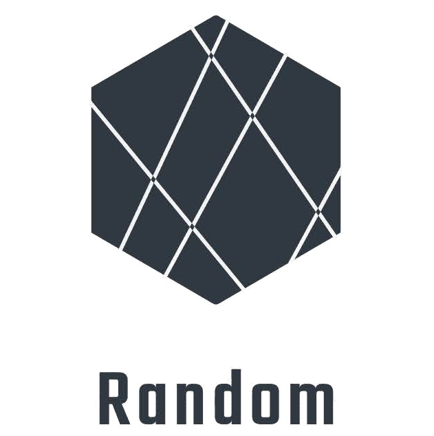

<!-- Help Edit this file with https://rahuldkjain.github.io/gh-profile-readme-generator/ -->

<h1 align="center">Hi, I'm Alejandro Cordón</h1>

<h3 align="center">A passionate developer from Spain</h3>

  

<h4 align="center"> Lets face it. This is not the worse thing you've caught me doing. </h4>

<!-- 
  
 

- 🌱 I’m currently learning **about life.**

-->

<h3 align="center">Connect with me:</h3>

<!--

&nbsp;

-->

<!--
**sodapop/sodapop** is a ✨ _special_ ✨ repository because its `README.md` (this file) appears on your GitHub profile.

Here are some ideas to get you started:

- 🔭 I’m currently working on ...
- 🌱 I’m currently learning ...
- 👯 I’m looking to collaborate on ...
- 🤔 I’m looking for help with ...
- 💬 Ask me about ...
- 📫 How to reach me: ...
- 😄 Pronouns: ...
- ⚡ Fun fact: ...
-->
